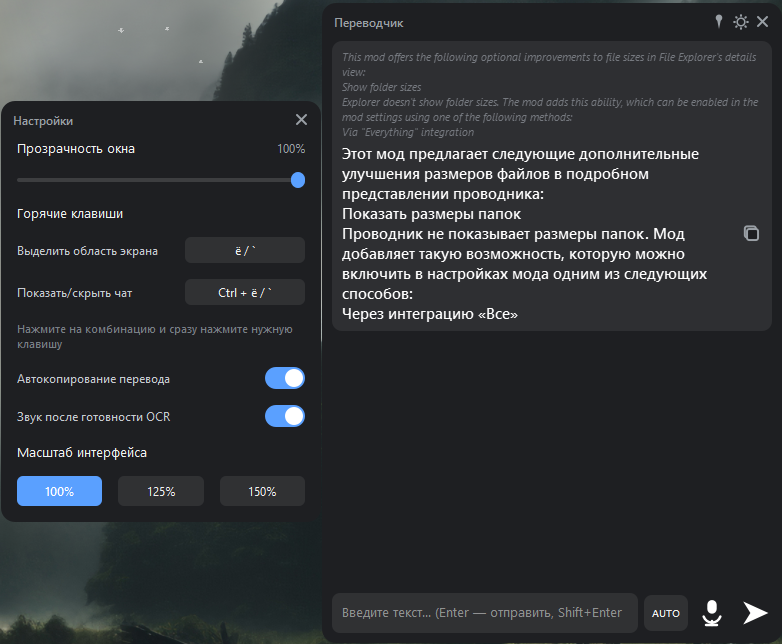

Современный переводчик с экрана с интерфейсом в виде чата.

Создан в первую очередь для общения в играх, но подходит для перевода любого текста на экране.

  

✨ Возможности
🖥️ Перевод текста с выделенной области экрана (OCR)
💬 Перевод текста, введённого вручную
🎤 Голосовой ввод (Push-to-Talk)
🌍 Автоматическое определение направления перевода (RU ↔ EN)
📋 Автоматическое или ручное копирование перевода
📌 Три режима закрепления окна
🔊 Звуковое уведомление после завершения OCR
⚙️ Настройка прозрачности, масштаба и горячих клавиш
💾 Автоматическое сохранение всех настроек
🚀 Не требует локальных моделей — всё работает через облачные сервисы
📖 Как это работает

Приложение работает в фоне и отображает компактное окно в виде чата поверх остальных окон.

Оно умеет:

распознавать текст с любой области экрана;
переводить его;
переводить введённый вручную текст;
переводить речь с микрофона;
сохранять историю переводов в удобном интерфейсе.

Все операции распознавания и перевода выполняются в облаке, поэтому для работы требуется подключение к интернету.

🚀 Установка
1. Установить Python 3.10+
2. Установить зависимости
pip install -r requirements.txt
3. Запустить
python main.py

Важно

В Windows рекомендуется запускать программу от имени администратора, иначе глобальные горячие клавиши могут не работать поверх игр с античитом или повышенными правами.

🔑 Настройка API
OCR.Space

Получить бесплатный API-ключ:

https://ocr.space/ocrapi/freekey

После получения вставить его в:

OCR_SPACE_API_KEY = "ВАШ_КЛЮЧ"

По умолчанию используется демонстрационный ключ helloworld, но он общий и значительно медленнее.

DeepL (необязательно)

Для более качественного перевода можно получить бесплатный API-ключ:

https://www.deepl.com/pro-api

Если ключ не указан, автоматически используется Google Translate.

⌨️ Горячие клавиши

По умолчанию:

Клавиша	Действие
Ё	Выделить область экрана
Ctrl + Ё	Показать / скрыть окно

Все комбинации можно изменить прямо в программе без перезапуска.

🎤 Голосовой ввод

Удерживайте кнопку микрофона.

Во время записи отображается анимация уровня громкости.

После отпускания кнопки:

речь распознаётся;
автоматически переводится;
появляется в окне чата.

Поддерживаются режимы:

AUTO
RU
EN
🖥️ Перевод экрана

OCR сохраняет:

переносы строк;
структуру сообщений;
игровые ники;
форматирование чата.

Благодаря этому игровые переписки читаются значительно удобнее.

📌 Закрепление окна

Доступно три режима:

📌 Всегда поверх окон
🎮 Поверх только игр
🪟 Обычный режим
⚙️ Настройки

Можно изменить:

прозрачность;
масштаб интерфейса;
горячие клавиши;
звук уведомлений;
автокопирование;
положение окна.

Все настройки сохраняются автоматически.

🎨 Интерфейс

Программа поддерживает:

плавные анимации;
масштабирование 100 / 125 / 150%;
анимацию появления сообщений;
анимацию записи голоса;
красивые векторные иконки;
историю сообщений;
индикаторы выполнения OCR и перевода.
🌐 Используемые сервисы
Назначение	Сервис
OCR	OCR.Space
Основной перевод	DeepL
Резервный перевод	Google Translate
Голос	SpeechRecognition
💡 Особенности

✅ Не требует установки нейросетей

✅ Не требует видеокарты

✅ Работает сразу после запуска

✅ Минимальная нагрузка на систему

📄 Лицензия

Проект распространяется по лицензии MIT.
